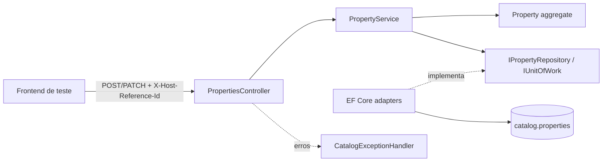

# TechSpec: Cadastro de Property

> **Modo de operação:** API-First
> **PRD de origem:** `tasks/prd-cadastro-property/prd.md`
> **API Contract:** `tasks/prd-cadastro-property/api-contract.yaml`
> **Data:** 2026-09-12
> **Status:** Aprovado
> **Handoff:** approved — pode alimentar o Task Creator

---

## Resumo Executivo

A F01 será implementada dentro do serviço Catalog definido pela TechSpec aprovada da Fundação da
Fase 0, mantendo a separação `API → Application → Domain` e `Infrastructure → Domain/Application`.
Dois endpoints de Controller delegam os casos de uso a um `PropertyService` simples: criação de uma
`Property` ativa e edição parcial de nome/localização. A entidade de domínio preserva identidade,
Host responsável e status; EF Core persiste o aggregate na tabela `catalog.properties` por meio de
repositório específico e Unit of Work, com um único `SaveChangesAsync` por operação.

O contrato OpenAPI é a fonte de verdade para rotas, schemas, autenticação ausente e respostas. A
implementação acrescenta validação explícita de presença em `PATCH`, rejeição de propriedades JSON
desconhecidas, `IExceptionHandler` global para o `ProblemDetails` estendido e testes com PostgreSQL
real via Testcontainers. Não há evento, mensageria, cache, autenticação, consulta pública ou
instrumentação OpenTelemetry nesta feature.

**Trade-off primário:** o Service Pattern simples reduz classes e indireção para dois casos de uso
CRUD sobre um único aggregate, em troca de não separar cada operação em command/handler. Se Catalog
ganhar consultas com projeções próprias ou orquestrações mais complexas nas próximas features, essas
operações poderão migrar isoladamente para CQRS nativo, sem MediatR e sem alterar o contrato da F01.

---

## Skills de Referência

| Skill | Caminho | Decisões Influenciadas |
|---|---|---|
| `tsg-flow-techspec-creator` | `.agents/skills/tsg-flow-techspec-creator` | Estrutura do documento, fatias verticais, inventário e ciclo de aprovação |
| `dotnet-architecture` | `.agents/skills/dotnet-architecture` | Clean Architecture, Service Pattern simples, repositório específico e `IExceptionHandler` |
| `dotnet-dependency-config` | `.agents/skills/dotnet-dependency-config` | EF Core/Npgsql, Fluent API, Unit of Work, migration e registro por DI |
| `dotnet-program-setup` | `.agents/skills/dotnet-program-setup` | `Program.cs` apenas como orquestrador e extensões separadas por concern |
| `dotnet-testing` | `.agents/skills/dotnet-testing` | xUnit/AwesomeAssertions e integração com `WebApplicationFactory` + PostgreSQL Testcontainers |
| `dotnet-observability` | `.agents/skills/dotnet-observability` | Logs estruturados, `traceId` nos erros e preservação dos health checks existentes |

---

## Arquitetura do Sistema

### Visão Geral dos Componentes

- **`PropertiesController`**: adapta header, path e JSON do contrato para os inputs da Application;
  não contém regra de negócio nem acesso a EF Core.
- **`PropertyService`**: valida entradas, orquestra criação/edição, consulta o repositório, aciona
  invariantes do aggregate e confirma uma única unidade de trabalho.
- **`Property`**: aggregate root puro que cria identidade estável, inicia em `Active`, verifica
  ownership e permite alterar somente nome/localização.
- **`IPropertyRepository` / `IUnitOfWork`**: portas da Application para persistência.
- **`PropertyRepository` / `CatalogUnitOfWork`**: adaptadores EF Core sobre o `CatalogDbContext`.
- **`CatalogExceptionHandler`**: converte validação, ausência, falta de ownership e falha inesperada
  no schema `ProblemDetails` do contrato.
- **PostgreSQL `catalog.properties`**: fonte interna de verdade de `Property`; nenhum outro domínio
  recebe acesso direto.

### Diagrama de Componentes



---

## Estratégia de Entrega Incremental

### Mapa de Fatias Verticais

| Slice | Comportamento observável | US/RF/RN cobertos | Entrada → processamento → saída | Artefatos principais | Evidência / checkpoint | Bloqueado por |
|---|---|---|---|---|---|---|
| V-01 | Host cadastra uma Property ativa; entradas inválidas não persistem nada e duplicatas de nome/localização são aceitas | História “cadastrar hospedagem”; RF-01; DP-01 | `POST /v1/properties` + header/body → binding e validação → `Property.Create` → repository/UoW → `201`, `Location` e body ou `400/500` contratual | Aggregate, create input/validator, service, repository, mapping EF, migration, Controller, error handler, testes unitários e de integração | `dotnet test` focado em criação; cenários 201, validações, JSON desconhecido, duplicata e ausência de persistência parcial; OpenAPI gerado contém `createProperty` | Fundação EN-01 e V-01 concluídas |
| V-02 | Host responsável altera parcialmente nome/localização; os demais dados permanecem estáveis e falhas preservam o estado anterior | História “corrigir dados”; RF-02; DP-02; fronteira de F07 | `PATCH /v1/properties/{id}` + header/body → presença/validação → load tracked → existência/ownership → atualização do aggregate → UoW → `200` ou `400/403/404/500` | Update input com presença explícita, validator, método de domínio, fluxo update do service/repository, endpoint, testes e export final do contrato | `dotnet test` focado em edição e suíte Catalog; cenários patch de um/dois campos, body vazio/null/desconhecido, 403, 404, atomicidade e imutabilidade; diff do OpenAPI sem incompatibilidade | V-01 |

Cada checkpoint inclui código, migration/configuração estritamente necessária, testes e logs do
comportamento entregue. O contrato completo permanece versionado desde o início; V-01 pode validar
somente `createProperty`, enquanto V-02 fecha a conformidade das duas operações.

### Habilitadores inevitáveis

Nenhum habilitador horizontal novo. A solution, o `CatalogDbContext`, Swagger, CORS, health checks,
convenções de build e projetos de teste pertencem à TechSpec aprovada
`tasks/prd-fundacao-fase0/techspec.md`. A implementação da F01 só começa após EN-01 e V-01 daquela
TechSpec existirem no repositório; eventuais arquivos equivalentes produzidos pela fundação devem
ser estendidos, nunca recriados em paralelo.

---

## Design de Implementação

### Interfaces Principais

```csharp
public interface IPropertyService
{
    Task<PropertyResult> CreateAsync(
        CreatePropertyInput input,
        CancellationToken cancellationToken);

    Task<PropertyResult> UpdateAsync(
        Guid propertyId,
        Guid requestingHostReferenceId,
        UpdatePropertyInput input,
        CancellationToken cancellationToken);
}
```

```csharp
public interface IPropertyRepository
{
    Task AddAsync(Property property, CancellationToken cancellationToken);
    Task<Property?> GetByIdForUpdateAsync(Guid id, CancellationToken cancellationToken);
}

public interface IUnitOfWork
{
    Task<int> SaveChangesAsync(CancellationToken cancellationToken);
}
```

`GetByIdForUpdateAsync` devolve entidade rastreada porque V-02 é uma operação de escrita. Não será
criado repositório genérico nem Domain Service: a feature precisa apenas das duas operações acima,
e as invariantes pertencem ao aggregate `Property`.

### Modelos de Dados

#### Aggregate de domínio

| Membro | Tipo | Regra |
|---|---|---|
| `Id` | `Guid` | Gerado na criação, público, estável e imutável |
| `Name` | `string` | Obrigatório, contém caractere não branco, máximo 120; alterável |
| `Location` | `string` | Obrigatório, contém caractere não branco, máximo 500; alterável |
| `HostReferenceId` | `Guid` | Obrigatório, define ownership e é imutável na F01 |
| `Status` | `PropertyStatus` | Inicia em `Active`; `Inactive` existe para compatibilidade do contrato/F07, mas não é alterado na F01 |

A validação FluentValidation ocorre antes de qualquer efeito. A entidade repete as invariantes
essenciais de nome/localização e ownership para impedir estado inválido por chamadores internos.
Valores aceitos são preservados como enviados; a feature não aplica trim ou normalização sem regra
de produto. Duplicidade não é consultada nem rejeitada.

#### Persistência

| Modelo técnico | Local | Mapeamento PostgreSQL |
|---|---|---|
| `Property` | Domain + configuração EF separada | `catalog.properties` |
| `Id` | PK | `id uuid`, sem geração pelo banco |
| `Name` | obrigatório | `name varchar(120)` |
| `Location` | obrigatório | `location varchar(500)` |
| `HostReferenceId` | obrigatório | `host_reference_id uuid` |
| `Status` | enum convertido para string | `status varchar(16)` |

Não há índice de unicidade por nome/localização nem colunas de auditoria sem requisito. A migration
`AddProperties` cria a tabela no schema `catalog` e remove a sentinela `__bootstrap_check` se ela
ainda existir, conforme a decisão já aprovada na Fundação. Migrations são aplicadas por step
explícito, nunca automaticamente no boot de produção.

#### Tipos HTTP e Application

- Requests/responses HTTP derivam dos schemas `CreatePropertyRequest`, `UpdatePropertyRequest` e
  `Property` do contrato, mas não são entidades EF.
- O header é adaptado separadamente para `Guid`; não entra no body de criação/edição.
- `UpdatePropertyInput` carrega, para cada campo, o indicador de presença e o valor. Isso distingue
  campo omitido de `null`, permite rejeitar `null` e garante `minProperties: 1` sem transformar
  `PATCH` em substituição total.
- O mecanismo concreto de presença pode ser um DTO com setters que registram presença ou um
  converter `Optional<T>` pequeno; ele deve permanecer na borda HTTP e ser provado por testes.
- Mapeamento entre HTTP, Application e Domain é manual; a quantidade de campos não justifica Mapster.

### Endpoints de API

> Rotas, schemas, ausência de autenticação e formato de erro são definidos no
> [API Contract](api-contract.yaml). Esta TechSpec não os duplica.

| operationId | Caminho de Implementação |
|---|---|
| `createProperty` | `PropertiesController.CreateAsync` → `IPropertyService.CreateAsync` → `Property.Create` → `IPropertyRepository.AddAsync` → `IUnitOfWork.SaveChangesAsync` |
| `updateProperty` | `PropertiesController.UpdateAsync` → `IPropertyService.UpdateAsync` → `IPropertyRepository.GetByIdForUpdateAsync` → `Property.EnsureOwnedBy` / `UpdateDetails` → `IUnitOfWork.SaveChangesAsync` |

**Validações adicionais necessárias para materializar o contrato:**

| Endpoint | Validação | Local na Implementação |
|---|---|---|
| Ambos | Header e identificador de rota precisam ser UUIDs válidos | API/model binding + resposta de model state padronizada |
| Ambos | Propriedades JSON fora do schema são rejeitadas | Atributo/configuração `System.Text.Json` restrita aos DTOs da F01, com unmapped members disallowed |
| `createProperty` | Campos presentes, não nulos, não vazios/não brancos e dentro de 120/500 | Application/FluentValidation + defesa no Domain |
| `updateProperty` | Ao menos um campo conhecido está presente; presente não pode ser `null`, vazio, branco ou exceder limite | API (presença) + Application/FluentValidation + defesa no Domain |
| `updateProperty` | Property existe antes de verificar ownership; Host do header coincide com o persistido | Application + Domain |

**Mapeamento de Exceções → ErrorResponse do Contrato:**

| Falha/Exceção | HTTP | `code` |
|---|---:|---|
| Erro de binding/JSON ou `FluentValidation.ValidationException` | 400 | `VALIDATION_ERROR` |
| `HostOwnershipForbiddenException` | 403 | `HOST_OWNERSHIP_FORBIDDEN` |
| `PropertyNotFoundException` | 404 | `PROPERTY_NOT_FOUND` |
| Exceção não mapeada | 500 | `INTERNAL_ERROR` |

O handler popula `type`, `title`, `status`, `detail`, `instance`, `code`, `details` (sempre array) e
`traceId`. O `traceId` usa o trace da requisição (`Activity.Current.TraceId`, com fallback para
`HttpContext.TraceIdentifier`); detalhes internos e stack traces não saem na resposta.

### Semântica transacional e concorrência

- Cada criação ou edição altera um único aggregate e executa exatamente um `SaveChangesAsync`; o EF
  Core/PostgreSQL garante atomicidade do comando.
- Validação, existência e ownership são avaliados antes do save. Em falha, nenhum save é chamado.
- A F01 não adiciona ETag, versão de linha nem resposta `409`, pois o contrato não define controle
  de concorrência. Escritas concorrentes no mesmo campo seguem last-write-wins do PostgreSQL/EF;
  adicionar concorrência otimista exige evolução explícita do contrato.
- CancellationToken é propagado de Controller até EF Core.

---

## Inventário de Artefatos

Os caminhos partem da estrutura aprovada na Fundação. `.../` abaixo representa somente os segmentos
já fixados (`services/catalog/src/...`) para manter a tabela legível, não liberdade para criar outra
árvore.

### Arquivos a Criar

| Caminho | Fatia | Tipo | Skills Aplicáveis | Descrição |
|---|---|---|---|---|
| `services/catalog/src/3-Domain/LocalizeStay.Catalog.Domain/Properties/Property.cs` | V-01/V-02 | Entity | `dotnet-architecture` | Aggregate e invariantes de criação, ownership e edição |
| `services/catalog/src/3-Domain/LocalizeStay.Catalog.Domain/Properties/PropertyStatus.cs` | V-01 | Enum | `dotnet-architecture` | Estados `Active`/`Inactive`, sem fluxo de desativação |
| `services/catalog/src/3-Domain/LocalizeStay.Catalog.Domain/Properties/HostOwnershipForbiddenException.cs` | V-02 | Exception | `dotnet-architecture` | Falha específica da regra de ownership |
| `services/catalog/src/2-Application/LocalizeStay.Catalog.Application/Abstractions/Persistence/IPropertyRepository.cs` | V-01 | Repository port | `dotnet-architecture` | Porta mínima de persistência do aggregate |
| `services/catalog/src/2-Application/LocalizeStay.Catalog.Application/Abstractions/Persistence/IUnitOfWork.cs` | V-01 | Unit of Work port | `dotnet-dependency-config` | Commit explícito e cancelável |
| `services/catalog/src/2-Application/LocalizeStay.Catalog.Application/Properties/IPropertyService.cs` | V-01 | Service port | `dotnet-architecture` | Interface dos dois casos de uso |
| `services/catalog/src/2-Application/LocalizeStay.Catalog.Application/Properties/PropertyService.cs` | V-01/V-02 | Use case | `dotnet-architecture`, `dotnet-observability` | Orquestra create/update e logs de sucesso/rejeição |
| `services/catalog/src/2-Application/LocalizeStay.Catalog.Application/Properties/Models/{CreatePropertyInput,UpdatePropertyInput,PropertyResult}.cs` | V-01/V-02 | Model | `dotnet-architecture` | Inputs internos e resultado independente de HTTP/EF |
| `services/catalog/src/2-Application/LocalizeStay.Catalog.Application/Properties/Validators/{CreatePropertyInputValidator,UpdatePropertyInputValidator}.cs` | V-01/V-02 | Validator | `dotnet-architecture` | Regras de campos e presença antes de efeitos |
| `services/catalog/src/2-Application/LocalizeStay.Catalog.Application/Properties/PropertyNotFoundException.cs` | V-02 | Exception | `dotnet-architecture` | Ausência da Property solicitada |
| `services/catalog/src/2-Application/LocalizeStay.Catalog.Application/DependencyInjection.cs` | V-01 | DI | `dotnet-program-setup` | Service e validators registrados por concern |
| `services/catalog/src/4-Infra/LocalizeStay.Catalog.Infra/Persistence/Configurations/PropertyConfiguration.cs` | V-01 | EF mapping | `dotnet-dependency-config` | Tabela/colunas/limites/conversão do enum |
| `services/catalog/src/4-Infra/LocalizeStay.Catalog.Infra/Persistence/Repositories/PropertyRepository.cs` | V-01/V-02 | Repository | `dotnet-dependency-config` | Add e leitura tracked por ID |
| `services/catalog/src/4-Infra/LocalizeStay.Catalog.Infra/Persistence/CatalogUnitOfWork.cs` | V-01 | Unit of Work | `dotnet-dependency-config` | Adaptador de `SaveChangesAsync` |
| `services/catalog/src/4-Infra/LocalizeStay.Catalog.Infra/Persistence/Migrations/*_AddProperties.cs` e arquivos EF associados | V-01 | Migration | `dotnet-dependency-config` | Cria `catalog.properties` e descarta sentinela |
| `services/catalog/src/1-Services/LocalizeStay.Catalog.Api/Contracts/Properties/{CreatePropertyRequest,UpdatePropertyRequest,PropertyResponse}.cs` | V-01/V-02 | DTO | `dotnet-architecture` | Tipos HTTP derivados do contrato, presença no PATCH e rejeição de membros desconhecidos nos requests |
| `services/catalog/src/1-Services/LocalizeStay.Catalog.Api/Controllers/PropertiesController.cs` | V-01/V-02 | Controller | `dotnet-architecture` | Endpoints finos `createProperty`/`updateProperty` |
| `services/catalog/src/1-Services/LocalizeStay.Catalog.Api/ErrorHandling/CatalogExceptionHandler.cs` | V-01/V-02 | Error handler | `dotnet-architecture`, `dotnet-observability` | Mapeia falhas para ProblemDetails contratual |
| `services/catalog/src/1-Services/LocalizeStay.Catalog.Api/Extensions/{Application,ErrorHandling}Extensions.cs` | V-01 | Config | `dotnet-program-setup` | Registros de Application e do handler global |
| `services/catalog/tests/LocalizeStay.Catalog.UnitTests/LocalizeStay.Catalog.UnitTests.csproj` | V-01 | Test project | `dotnet-testing` | Projeto xUnit de Domain/Application |
| `services/catalog/tests/LocalizeStay.Catalog.UnitTests/Properties/{PropertyTests,PropertyValidatorsTests}.cs` | V-01/V-02 | Unit test | `dotnet-testing` | Invariantes, limites, ownership e preservação |
| `services/catalog/tests/LocalizeStay.Catalog.IntegrationTests/Properties/{CreatePropertyTests,UpdatePropertyTests}.cs` | V-01/V-02 | Integration test | `dotnet-testing` | HTTP + DI + EF + PostgreSQL real |
| `services/catalog/tests/LocalizeStay.Catalog.IntegrationTests/Contracts/PropertyOpenApiContractTests.cs` | V-01/V-02 | Contract test | `dotnet-testing` | Compara operações/respostas críticas do OpenAPI gerado com o contrato fonte |

### Arquivos a Modificar

| Caminho | Fatia | Skills Aplicáveis | Alteração |
|---|---|---|---|
| `Directory.Packages.props` | V-01 | `dotnet-dependency-config` | Fixar somente FluentValidation, sua extensão de DI e logging abstractions se ainda ausentes |
| `services/catalog/LocalizeStay.Catalog.sln` | V-01 | `dotnet-architecture` | Adicionar projeto UnitTests e referências necessárias |
| `services/catalog/src/1-Services/LocalizeStay.Catalog.Api/Program.cs` | V-01 | `dotnet-program-setup` | Encadear extensões de Application e error handling |
| `services/catalog/src/1-Services/LocalizeStay.Catalog.Api/Extensions/SwaggerExtensions.cs` | V-01/V-02 | `dotnet-program-setup` | Preservar operationIds, schemas e base path definidos no contrato |
| `services/catalog/src/1-Services/LocalizeStay.Catalog.Api/LocalizeStay.Catalog.Api.csproj` | V-01 | `dotnet-dependency-config` | Referências de projeto/pacote estritamente necessárias |
| `services/catalog/src/2-Application/LocalizeStay.Catalog.Application/LocalizeStay.Catalog.Application.csproj` | V-01 | `dotnet-dependency-config` | FluentValidation e referência ao Domain |
| `services/catalog/src/4-Infra/LocalizeStay.Catalog.Infra/LocalizeStay.Catalog.Infra.csproj` | V-01 | `dotnet-dependency-config` | Referência à Application para implementar portas |
| `services/catalog/src/4-Infra/LocalizeStay.Catalog.Infra/Persistence/CatalogDbContext.cs` | V-01 | `dotnet-dependency-config` | Adicionar `DbSet<Property>` e aplicar configurações do assembly |
| `services/catalog/src/1-Services/LocalizeStay.Catalog.Api/Extensions/PersistenceExtensions.cs` | V-01 | `dotnet-dependency-config`, `dotnet-program-setup` | Registrar repository e Unit of Work |
| `services/catalog/tests/LocalizeStay.Catalog.IntegrationTests/CustomWebApplicationFactory.cs` | V-01 | `dotnet-testing` | Aplicar migration e isolar dados por teste no container existente |
| `services/catalog/tests/LocalizeStay.Catalog.IntegrationTests/LocalizeStay.Catalog.IntegrationTests.csproj` | V-01 | `dotnet-testing` | Referências de teste/contrato se ainda ausentes |
| `contracts/openapi/catalog.json` | V-01/V-02 | `dotnet-program-setup` | Atualizar export gerado; V-02 fecha conformidade com as duas operações |
| Configuração do API Service Catalog no OpenMetadata | V-02 | `dotnet-observability` | Reexecutar ingestion do OpenAPI e confirmar ownership/operationIds |

### Arquivos de Referência (não alterar)

| Caminho | Motivo da Consulta |
|---|---|
| `tasks/prd-cadastro-property/prd.md` | Requisitos, non-goals, decisões DP-01/DP-02 e critérios Must Have |
| `tasks/prd-cadastro-property/api-contract.yaml` | Fonte de verdade de endpoints, schemas e erros |
| `tasks/prd-cadastro-property/api-contract.md` | Racional, decisões e exemplos narrativos do contrato aprovado |
| `domains/catalog/domain.md` | Vocabulário, ownership e dependências downstream F02/F03/F07 |
| `context/architecture-baseline.md` | Fronteira do serviço, schema, segurança e observabilidade da Fase 0 |
| `tasks/prd-fundacao-fase0/techspec.md` | Estrutura física e bootstrap que devem existir antes da F01 |
| `docs/adr/adr-001-backend-stack-dotnet.md` | Stack .NET/ASP.NET Core/EF Core já aceita |

---

## Pontos de Integração

- **PostgreSQL `localize_stay` no `postgres-main`:** acesso somente com `catalog_role` ao schema
  `catalog`; connection string por `user-secrets`/variável de ambiente; timeout e health check
  herdados da Fundação. Sem retry de regra de negócio, cache ou acesso cross-domain.
- **OpenMetadata:** após V-02, reingerir `contracts/openapi/catalog.json` e verificar que
  `createProperty`/`updateProperty`, versão `/v1`, ownership Catalog e lineage de consumidor externo
  aparecem sem criar outro API Service.
- Não há integração RabbitMQ, Booking, Payment ou Notification nesta feature.

---

## Análise de Impacto

| Componente Afetado | Tipo de Impacto | Descrição & Risco | Ação Requerida |
|---|---|---|---|
| Serviço Catalog | Modificado | Primeiros endpoints e regras de negócio; risco médio por estabelecer padrão das features seguintes | Manter controllers finos e provar pipeline completo com integração |
| Schema `catalog` | Modificado | Nova tabela interna `properties`; risco médio de migration e grants incorretos | Gerar/revisar script idempotente e executar com `catalog_role` |
| Contrato OpenAPI Catalog | Modificado | Skeleton passa a expor F01; risco alto de drift com consumidor frontend | Teste de contrato e export versionado no checkpoint V-02 |
| OpenMetadata | Modificado | API Catalog ganha duas operações; risco baixo de catálogo desatualizado | Reingerir e conferir owner/tag já existentes |
| F02/F03/F07 | Dependência futura | Passam a poder referenciar `Property.Id`; sem chamada ou alteração atual | Preservar UUID, aggregate e ownership; não antecipar endpoints |
| Booking/Payment/Notification | Nenhum | F01 não cruza fronteira de domínio nem publica evento | Nenhuma |

---

## Abordagem de Testes

### Testes Unitários

- xUnit + AwesomeAssertions, AAA e nomes `MethodName_Condition_ExpectedBehavior`.
- `Property.Create`: UUID próprio, status `Active`, Host preservado e valores válidos.
- Validators: ausente/null/vazio/somente branco, limites 120/500, acima do limite e presença do PATCH.
- `Property.EnsureOwnedBy`/`UpdateDetails`: Host correto, Host divergente, alteração de cada campo,
  preservação de ID/Host/status e ausência de alteração após exceção.
- Nenhum mock da entidade de domínio. Repositório/EF e transação são provados na integração, em vez
  de testar chamadas internas de implementação.

### Testes de Integração

- `WebApplicationFactory<Program>` + Testcontainers PostgreSQL, aplicando a migration real; não usar
  EF InMemory/SQLite.
- V-01: 201/body/Location/persistência; header/body/limites inválidos; propriedades desconhecidas;
  duas Properties iguais aceitas com IDs diferentes; cancelamento propagado quando aplicável.
- V-02: patch só de nome, só de localização e de ambos; 400 para body vazio, null, branco, excesso e
  campos não editáveis; 403 para Host divergente; 404 para ID ausente; 200 preserva ID/Host/status.
- Em todo erro, consultar o banco após a resposta e provar zero criação ou estado anterior intacto.
- Validar content type `application/problem+json`, todos os campos obrigatórios, `details: []` quando
  não houver erro de campo e `traceId` não vazio.
- Fixture determinística limpa dados entre testes e não depende do `postgres-main` do homelab.

### Testes de Contrato

- Validar `api-contract.yaml` como OpenAPI 3.1 antes da suíte.
- Obter o documento gerado pelo serviço e comparar, após resolver `servers[].url` + path, no mínimo, paths/métodos, operationIds,
  parâmetros obrigatórios, media types, status codes, propriedades obrigatórias, limites e enums
  das operações F01 contra o YAML fonte.
- Executar cenários HTTP de cada resposta declarada. O teste 500 usa substituição controlada da
  Unit of Work no host de teste e comprova ausência de detalhes internos.
- O export `contracts/openapi/catalog.json` só é atualizado após os testes passarem; mudança
  incompatível exige alteração prévia do contrato fonte e nova revisão.

---

## Sequenciamento de Desenvolvimento

### Build Order

1. Confirmar Fundação EN-01/V-01 presente e contrato fonte validável — dependência externa desta
   TechSpec; evidência: solution Catalog compila e health checks existentes passam.
2. V-01, modelo/migration + criação ponta a ponta — depende de 1; evidência: testes unitários de
   invariantes/validator e integração do `createProperty` passam, incluindo duplicata aceita.
3. V-02, edição parcial + erros/contrato completo — depende de 2; evidência: suíte Catalog passa,
   OpenAPI gerado é compatível e ingestão no OpenMetadata mostra as duas operações.

### Dependências Técnicas Bloqueantes

- A Fundação da Fase 0 ainda não está materializada no worktree atual: não existem solution/projetos
  Catalog, `Directory.Packages.props`, `CatalogDbContext` ou testes-base. Executar ao menos EN-01 e
  V-01 de `tasks/prd-fundacao-fase0/techspec.md` antes das tasks desta feature.
- Contrato e TechSpec foram aprovados em 2026-09-12; o YAML permanece como fonte de verdade
  API-first para geração, implementação e testes.
- Docker compatível com Testcontainers é necessário no ambiente de execução dos testes, conforme a
  Fundação aprovada.

---

## Monitoramento e Observabilidade

- Preservar `/health/live` e `/health/ready`; a nova tabela não cria um health check separado porque
  a readiness já prova a conexão PostgreSQL necessária.
- Logs estruturados de sucesso: `PropertyCreated` e `PropertyUpdated`, com `propertyId`,
  `hostReferenceId`, operação e trace ID. Não registrar nome/localização nem body completo.
- Falha de ownership gera warning com IDs e trace ID; validações esperadas não geram stack trace.
- Exceção inesperada gera error com exceção no log e resposta sanitizada `INTERNAL_ERROR`.
- O `traceId` retornado permite correlacionar resposta e log. Não adicionar OpenTelemetry, métricas
  ou alertas na Fase 0, conforme baseline.
- Governança: OpenAPI exportado e API Catalog atualizada no OpenMetadata no checkpoint final.

---

## Considerações Técnicas

### Decisões Principais

- **Decisão:** Service Pattern simples, sem CQRS/MediatR.
  **Racional:** dois comandos CRUD curtos sobre um aggregate não justificam dispatcher/handlers.
  **Trade-offs:** menor granularidade por tipo de operação; migração futura pode extrair apenas os
  casos de uso que crescerem.
  **Alternativas rejeitadas:** CQRS nativo agora, por indireção sem necessidade; MediatR, proibido
  pela skill de arquitetura adotada.

- **Decisão:** Controller ASP.NET Core em vez de Minimal API.
  **Racional:** concentra model binding de path/header/body, customização uniforme de model state e
  metadata OpenAPI das duas operações no padrão já preparado pela Fundação.
  **Trade-offs:** uma classe/atributos a mais; mantém a borda explícita para um contrato estrito.
  **Alternativas rejeitadas:** Minimal API, válida mas sem benefício concreto neste fluxo.

- **Decisão:** entidade de domínio também é a entidade mapeada pelo EF, com configuração Fluent API
  separada; DTOs HTTP nunca vazam para persistência.
  **Racional:** não há divergência entre modelo de domínio e armazenamento que justifique um segundo
  modelo persistente e um mapper.
  **Trade-offs:** construtor privado e configuração EF precisam respeitar encapsulamento.
  **Alternativas rejeitadas:** modelo EF separado, por duplicação sem regra de transformação.

- **Decisão:** `PATCH` representa presença separadamente do valor.
  **Racional:** o contrato exige campo opcional, rejeita `null`, exige ao menos uma propriedade e
  rejeita propriedades desconhecidas; `string?` isolado não distingue omissão de null.
  **Trade-offs:** pequeno mecanismo adicional na borda HTTP.
  **Alternativas rejeitadas:** tratar null como omitido, pois violaria o schema; JSON Merge Patch,
  porque mudaria o media type/semântica contratados.

- **Decisão:** não adicionar concorrência otimista na F01.
  **Racional:** o contrato não oferece ETag/version nem resposta de conflito, e a escala é de
  laboratório.
  **Trade-offs:** edições simultâneas do mesmo campo usam last-write-wins.
  **Alternativas rejeitadas:** token de versão oculto, porque criaria comportamento não contratado.

### Riscos Conhecidos

- **Drift OpenAPI:** atributos/serialização ASP.NET podem divergir de OpenAPI 3.1, especialmente
  `additionalProperties: false`, nulabilidade e presença em PATCH. Mitigação: configuração JSON
  estrita, teste de contrato e cenários HTTP específicos.
- **Fundação ainda ausente:** caminhos foram herdados de uma TechSpec aprovada, não verificados em
  código materializado. Mitigação: dependência explícita e extensão dos artefatos reais após a
  fundação, sem criar estrutura concorrente.
- **Erro 500 difícil de provocar:** falhas reais são não determinísticas. Mitigação: substituir a
  Unit of Work apenas no host de integração para lançar exceção antes do commit.
- **Sentinela já removida ou inexistente:** a ordem de migrations pode variar durante implementação
  da Fundação. Mitigação: gerar a migration sobre o snapshot real e só remover
  `__bootstrap_check` quando ela fizer parte do modelo aplicado.

### Requisitos Especiais

- Dados exclusivamente fictícios; não registrar nome/localização em logs.
- Nenhuma autenticação/autorização real. `X-Host-Reference-Id` aplica apenas ownership de negócio e
  não deve ser descrito ou tratado como identidade autenticada.
- Sem requisito adicional de performance: consultas por PK e escrita de aggregate único. Não criar
  cache, paginação ou índice antecipado.

### Conformidade com Skills

- Segue `dotnet-architecture`: camadas apontam para dentro, Domain puro, Controller fino, Service
  Pattern deliberado, portas de persistência e `IExceptionHandler`/ProblemDetails.
- Segue `dotnet-dependency-config`: PostgreSQL/EF Core, Fluent API, Unit of Work, DI, migration
  explícita e nenhuma credencial versionada.
- Segue `dotnet-program-setup`: novos concerns ficam em extensões; `Program.cs` só orquestra.
- Segue `dotnet-testing`: xUnit/AwesomeAssertions e integração com PostgreSQL Testcontainers.
- Segue `dotnet-observability` dentro do baseline: logging estruturado e correlacionável, sem PII.

**Desvios identificados:**

| Desvio | Skill | Justificativa |
|---|---|---|
| Sem OpenTelemetry/tracing/métricas formais | `dotnet-observability` | Baseline aprovado reserva esses sinais para a Fase 1; F01 usa apenas trace ID nativo e logging estruturado |
| Sem container PostgreSQL local para execução da aplicação | `dotnet-dependency-config` | Fundação aprovada usa `postgres-main` no homelab; Testcontainers continua obrigatório na suíte automatizada |

---

## Questões em Aberto

Nenhuma. O contrato e as decisões de implementação — Service Pattern simples, Controller, entidade
de domínio mapeada diretamente pelo EF, presença explícita no PATCH e ausência de concorrência
otimista na F01 — foram aprovados em 2026-09-12. Não há lacuna funcional ou de schema entre PRD e
contrato identificada nesta revisão.

---

## Architecture Decision Records

Nenhuma ADR nova é proposta. Esta TechSpec aplica decisões já aceitas e faz escolhas locais,
reversíveis e limitadas à F01.

- [ADR-001: Stack de backend — .NET / C# (ASP.NET Core)](../../docs/adr/adr-001-backend-stack-dotnet.md)
  — define stack e EF Core.
- O baseline de Service-Based Architecture, ownership por schema e observabilidade da Fase 0 é
  herdado de `context/architecture-baseline.md`; F01 não altera essas decisões.
- ADR-002 (RabbitMQ) e ADR-003 (frontend React) não são afetadas por esta feature.

---

## Próximos Passos

1. Executar `tsg-flow-task-creator` usando PRD, contrato e TechSpec aprovados, registrando a
   dependência da Fundação EN-01/V-01 nas tasks da F01.
2. Materializar a Fundação EN-01/V-01 antes de executar as tasks da F01.
